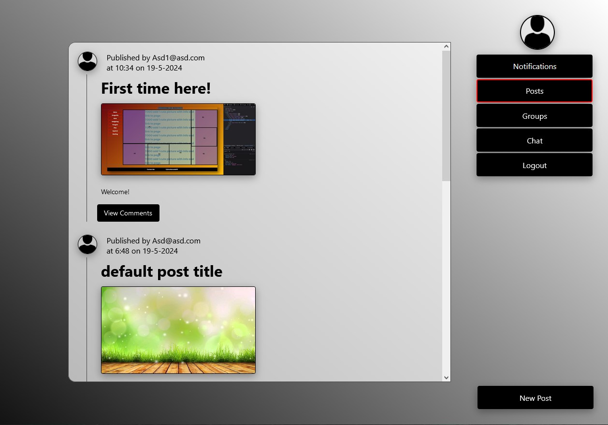
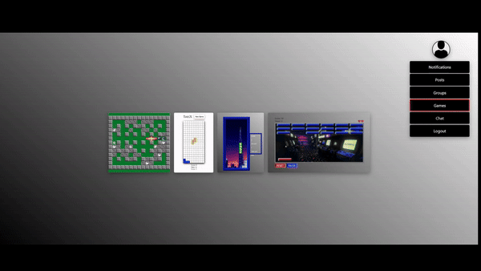

# Gaming Networking

[](https://github.com/The-Estonian/networking/actions)
[](https://opensource.org/license/mit)
[](https://reactjs.org/)
[](https://golang.org/)

## Project Description

Gaming Networking is a social network project that aims to collect previous projects into one centralized package and it includes past work of all the project participants.

### Tech Stack:

- **Frontend**: React, Mini-Framework
- **Backend**: Golang
- **Database**: SQLite

## Table of Contents

- [How to Run the Project](#how-to-run-the-project)
  - [Live Version](#live-version)
  - [Run Locally](#run-locally)
- [Audit](#audit)
- [Screenshots](#screenshots)
- [Usage](#usage)
- [Contributing](#contributing)
- [License](#license)
- [Contact](#contact)

## How to Run the Project

### Live Version

Check out the live project: [LIVE](https://www.devpipe.ee)

**Default users**:

- `user@email.com` / password: Password
- `user1@email.com` / password: Password
- `user2@email.com` / password: Password
- `user3@email.com` / password: Password

### Run Locally

To run the project locally, follow these steps:

#### Prerequisites

- Golang installed
- Node.js and npm installed

#### Steps

1. **Clone the repository**:

   ```bash
   git clone https://01.kood.tech/git/jsaar/social-network
   cd networking
   ```

2. **Run the backend**:

   - Open the first terminal

   ```bash
   cd backend
   go get
   go run .
   ```

3. **Run the frontend**:
   - Open the second terminal
   ```bash
   cd frontend
   npm install
   npm run dev
   ```

## Audit

To audit the program, follow the steps [here](https://github.com/01-edu/public/tree/master/subjects/bomberman-dom/audit).

## Screenshots

Here's screenshots of the project:




## Usage

After running the project locally, you can log in with the default users provided above or register new ones. Explore the various features and see if you like it and stay forever.

## Contributing

We welcome contributions! Please contact one of the authors in discord if you would like to contribute to future projects.

## License

This project is licensed under the MIT License. See the [LICENSE](https://opensource.org/license/mit) file for details.

## Contact

For any questions or suggestions, feel free to contact us directly at `Kood / Jõhvi Discord`.

_Authors: [Jaanus Saar](https://01.kood.tech/git/jsaar), [Ivar Mihhailov](https://01.kood.tech/git/imihhail), [Oliver Vilu](https://01.kood.tech/git/ovilu)_
